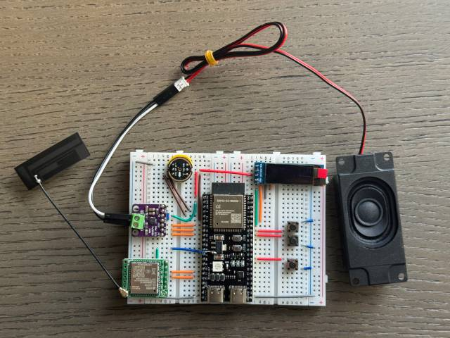

【相关命令：】
idf.py build

export IDF_TARGET=esp32s3

idf.py set-target esp32s3

idf.py build flash monitor

CONFIG_LWIP_IPV4_NAPT

idf.py menuconfig

# 小智 AI 聊天机器人

BiliBili 视频介绍 [【ESP32+SenseVoice+Qwen72B打造你的AI聊天伴侣！】](https://www.bilibili.com/video/BV11msTenEH3/?share_source=copy_web&vd_source=ee1aafe19d6e60cf22e60a93881faeba)

这是虾哥的第一个硬件作品。

## 项目目的

本项目基于乐鑫的 ESP-IDF 进行开发。

本项目是一个开源项目，主要用于教学目的。我们希望通过这个项目，能够帮助更多人入门 AI 硬件开发,了解如何将当下飞速发展的大语言模型应用到实际的硬件设备中。无论你是对 AI 感兴趣的学生，还是想要探索新技术的开发者，都可以通过这个项目获得宝贵的学习经验。

欢迎所有人参与到项目的开发和改进中来。如果你有任何想法或建议，请随时提出 issue 或加入群聊。

学习交流 QQ 群：946599635

## 已实现功能

- Wi-Fi 配网
- 支持 BOOT 键唤醒和打断
- 离线语音唤醒（使用乐鑫方案）
- 流式语音对话（WebSocket 协议）
- 支持国语、粤语、英语、日语、韩语 5 种语言识别（使用 SenseVoice 方案）
- 声纹识别（识别是谁在喊 AI 的名字，[3D Speaker 项目](https://github.com/modelscope/3D-Speaker)）
- 使用大模型 TTS（火山引擎方案，阿里云接入中）
- 支持可配置的提示词和音色（自定义角色）
- 免费提供 Qwen2.5 72B 和 豆包模型（受限于性能和额度，人多后可能会限额）
- 支持每轮对话后自我总结，生成记忆体
- 扩展液晶显示屏，显示信号强弱（后面可以显示中文字幕）
- 支持 ML307 Cat.1 4G 模块（可选）

## 硬件部分

为方便协作，目前所有硬件资料都放在飞书文档中：

[《小智 AI 聊天机器人百科全书》](https://ccnphfhqs21z.feishu.cn/wiki/F5krwD16viZoF0kKkvDcrZNYnhb?from=from_copylink)

第二版接线图如下：

## 固件部分

### 免开发环境烧录

新手第一次操作建议先不要搭建开发环境，直接使用免开发环境烧录的固件。

点击 [这里](https://github.com/78/xiaozhi-esp32/releases) 下载最新版固件。

固件使用的是作者友情提供的测试服，目前开放免费使用，请勿用于商业用途。

### 搭建开发环境

- Cursor 或 VSCode
- 安装 ESP-IDF 插件，选择 SDK 版本 5.3 或以上
- Ubuntu 比 Windows 更好，编译速度快，也免去驱动问题的困扰

### 配置项目与编译固件

- 目前只支持 ESP32 S3，Flash 至少 8MB, PSRAM 至少 2MB（注意：默认配置只兼容 8MB PSRAM，如果你使用 2MB PSRAM，需要修改配置，否则无法识别）
- 配置 OTA Version URL 为 `https://api.tenclass.net/xiaozhi/ota/`
- 配置 WebSocket URL 为 `wss://api.tenclass.net/xiaozhi/v1/`
- 配置 WebSocket Access Token 为 `test-token`
- 如果 INMP441 和 MAX98357 接线跟默认配置不一样，需要修改 GPIO 配置
- 配置完成后，编译固件

## 配置 Wi-Fi （4G 版本跳过）

按照上述接线，烧录固件，设备上电后，开发板上的 RGB 会闪烁蓝灯（部分开发板需要焊接 RGB 灯的开关才会亮），进入配网状态。

打开手机 Wi-Fi，连接上设备热点 `Xiaozhi-xxxx` 后，使用浏览器访问 `http://192.168.4.1`，进入配网页面。

选择你的路由器 WiFi，输入密码，点击连接，设备会在 3 秒后自动重启，之后设备会自动连接到路由器。

## 测试设备是否连接成功

设备连接上路由器后，闪烁一下绿灯。此时，喊一声“你好，小智”，设备会先亮蓝灯（表示连接服务器），然后再亮绿灯，播放语音。

如果没有亮蓝灯，说明麦克风有问题，请检查接线是否正确。

如果没有亮绿灯，或者蓝灯常亮，说明设备没有连接到服务器，请检查 WiFi 连接是否正常。

如果设备已经连接 Wi-Fi，但是没有声音，请检查是否接线正确。

在 v0.2.1 版本之后的固件，也可以按下连接 GPIO 1 的按钮（低电平有效），进行录音测试。

## 配置设备

如果上述步骤测试成功，设备会播报你的设备 ID，你需要到 [小智测试服的控制面板](https://xiaozhi.tenclass.net/) 页面，添加设备。

详细的使用说明以及测试服的注意事项，请参考 [小智测试服的帮助说明](https://xiaozhi.tenclass.net/help)。

